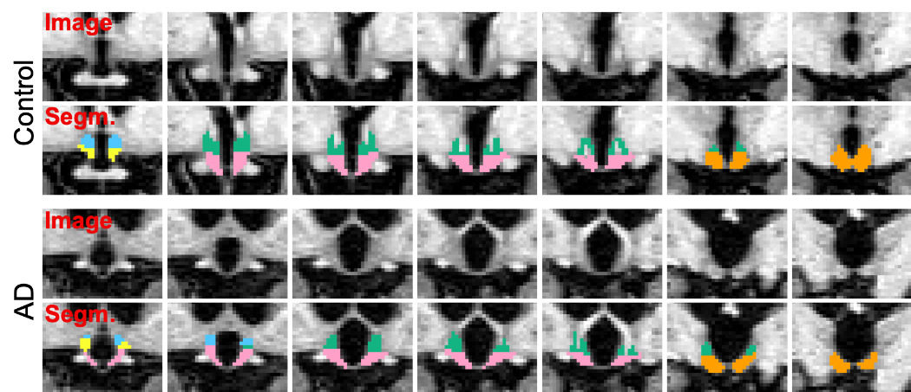

# hypothalamus_seg

This repository enables automated segmentation of the hypothalamus and its associated subunits in T1-weighted scans of 
approximatively 1mm isotropic resolution. \
The presented tool is based on a convolutional neural network, which allows to retrieve segmentations in a very short 
processing time (around 10 seconds with a CPU, less than a second with a GPU). \
The segmentation model was trained by applying aggressive data augmentation, which makes it robust against variability 
in acquisition parameters (sequence, platform, head positioning), and in anatomy (e.g. atrophy patterns linked to 
ageing or different pathologies).

\
More specifically, this code produces segmentation maps with 11 labels:

| Label number | Associated subunit      | Colour in figure below |
| :---         | :---                    | :---                   |
| 0            | background              | N/A                    |
| 1            | left anterior-inferior  | yellow                 |
| 2            | left anterior-superior  | blue                   |
| 3            | left posterior          | orange                 |
| 4            | left tubular inferior   | pink                   |
| 5            | left tubular superior   | green                  |
| 6            | right anterior-inferior | yellow                 |
| 7            | right anterior-superior | blue                   |
| 8            | right posterior         | orange                 |
| 9            | right tubular inferior  | pink                   |
| 10           | right tubular superior  | green                  |

\
The following figure illustrates two segmentation examples in coronal slices obtained by this model for a control 
subject, and a subject diagnosed with Alzheimer's disease. Subunit colours are indicated by the table above.



----------------

### Dependencies

**No requirement is needed to run the CPU version of this code, apart from downloading the tool itself.** \
The dependencies listed below are already provided with the tool, and are simply given here for information.

This code was implemented in python 3.6. The neural network was built in Keras with a Tensorflow 2.0 backend. An 
exhaustive list of the python dependencies can be found under `requirements.txt`. \
Moreover, this repository relies on several external python packages (already included for convenience):
- **[lab2im](https://github.com/BBillot/lab2im)**: contains functions for data augmentation, and image processing tools 
[1],
- **[neuron](https://github.com/adalca/neuron)**: contains functions for data augmentation, and to build the network 
[2,3],
- **[pytool-lib](https://github.com/adalca/pytools-lib)**: library required by the neuron package.

----------------

### Installation

##### 1- installing hypothalamus_seg
In order to download the segmentation tool (but not the code), click on one of the following links (depending on your 
operating system):
- Linux: [hypo_seg_linux.zip](https://liveuclac-my.sharepoint.com/:u:/g/personal/rmappmb_ucl_ac_uk/EWKGAzl-WqVGhWYMefe9_0oBXRTos0c6YaguiI4Q9PmUaQ?e=mNbZUJ)
- Mac: [hypo_seg_mac.zip](https://liveuclac-my.sharepoint.com/:u:/g/personal/rmappmb_ucl_ac_uk/Edm9o-EMEV1CoM45Ug5nmskB2s1KUAFAOZGAygNgfzzCxw?e=u9YVSf)
- Windows: [hypo_seg_windows.zip](https://liveuclac-my.sharepoint.com/:u:/g/personal/rmappmb_ucl_ac_uk/EaqzZMK_KjVGsNW1oSDMdAkBtPK5XQ4QUakWWC7ZjjXm7A?e=uaL8Rc)

This will take you to a OneDrive page where you can download a zip file by directly clicking on `Download` (top left). \
Once the file is downloaded, move it to the desired location on your computer, and unzip it. 

That's it, you can now use the CPU version of hypothalamus_seg !

##### 2- optional: running hypothalamus_seg on a GPU
The current set-up will allow you to obtain segmentations in approximatively 10s per scan (depending on your CPU).
If you have a GPU on your machine, this can be decreased below 1s per scan by installing the required libraries (GPU
driver, Cuda, CuDNN). \
These libraries are generally required for a GPU, and are not specific to hypothalamus_seg. In fact, you may already 
have installed them. In this case you can directly use this tool without taking any further actions, as the code will 
automatically run on your GPU. \
We show here how to install a GPU for an Nvidia graphic card. We warn the user that the following steps are more 
difficult than previously, as they may require to change some hardware settings.

- First we need to install cuda-10.0, and the Nvidia driver. While these two can be installed at the same time, we
recommend to install them separately, starting with the driver. Guidelines on how to do this can be found
[here](https://linuxconfig.org/how-to-install-the-nvidia-drivers-on-ubuntu-18-04-bionic-beaver-linux). We recommend the 
manual installation.

- Cuda-10.0 can be downloaded from [here](https://developer.nvidia.com/cuda-10.0-download-archive?target_os=Linux&target_arch=x86_64&target_distro=Ubuntu&target_version=1604&target_type=runfilelocal).
Again, we recommend to use the runfile installation. Guidelines on how to install Cuda-10.0 are explained in details in
[this document](https://developer.download.nvidia.com/compute/cuda/10.0/Prod/docs/sidebar/CUDA_Quick_Start_Guide.pdf).
You can check if the installation was successful by typing `nvidia-smi` in a command line.

- Finally you will need to download the cudnn-7.0 library. The step-by-step installation is available
[here](https://docs.nvidia.com/deeplearning/sdk/cudnn-install/index.html) (knowing that you can skip the step 2.1.1, 
since you already installed the graphic driver).

You can verify if this installation was successful by running this tool and looking for the name of your GPU in the 
printed output (in the terminal window).

##### 3- optional: developer installation

If you wish to train your own model, or to have a better look at the code, you can directly download this repository 
with:
```
git clone https://github.com/BBillot/hypothalamus_seg.git
```
This code includes functions to predict, and evaluate the trained models. We also provide scripts to call the training
and predicting functions from a terminal window (see [scripts](scripts)). \
See the Dependencies section for further details on the requirements.

----------------

### How to use this code

**Important**: The path to the `hypothalamus_seg` folder (e.g. `\home\user1\hypothalamus_seg`) will now be referred to 
as `<path to hypothalamus_seg>`. Thus, do not forget to replace it in the following instructions.

To use this code, you will first need to open a terminal window:
- in Linux: Ctrl+Alt+T
- in Mac: Go to Applications>Utilities and open Terminal
- in Windows: Search for PowerShell, right click on it, and select `Run as administrator`:

Once the terminal window is open, navigate to the folder `hypothalamus_seg`.
This can be done with the `cd` command:
```
cd <path to hypothalamus_seg>
```
Depending on your operatin system, you can then simply segment images by calling:
```
# In Linux or in Mac:
./hypo_seg <image> <segmentation> --out_posteriors <posteriors> --out_volumes <volume> 

# In Windows:
./hypo_seg.exe <image> <segmentation> --out_posteriors <posteriors> --out_volumes <volume> 
```
where (in all cases):
- `<image>` is the path to an image to segment. \
This can also be a folder, in which case all the image inside that folder will be segmented.
- `<segmentation>` is the path where the output segmentation will be saved. \
This must be a folder if `<path image>` designates a folder.
- `<posteriors>` (optional) is the path where the posteriors (given as soft probability maps) will be saved. \
This must be a folder if `<path image>` designates a folder.
- `<volume>` (optional) is the path to an output csv file where the volumes of all subunits
will be saved for all segmented scans (one csv file for all subjects; e.g. /path/to/volumes.csv)


\
You can have access to these explanations directly by typing once in `<path to hypothalamus_seg>`:
```
./hypo_seg -h        # In Linux or in Mac
./hypo_seg.exe -h    # In Windows
```

----------------

### Contacts

If you have any question regarding the usage of this code, or any suggestions to improve it, you can contact us at: \
benjamin.billot.18@ucl.ac.uk

----------------

### References

[1] *A Learning Strategy for Contrast-agnostic MRI Segmentation* \
Benjamin Billot, Douglas N. Greve, Koen Van Leemput, Bruce Fischl, Juan Eugenio Iglesias, Adrian V. Dalca \
MIDL 2020 \
[link](https://arxiv.org/abs/2003.01995)

[2] *Anatomical Priors in Convolutional Networks for Unsupervised Biomedical Segmentation* \
Adrian V. Dalca, John Guttag, Mert R. Sabuncu \
CVPR 2018 \
[link]((http://www.mit.edu/~adalca/files/papers/cvpr2018_priors.pdf))

[3] *Unsupervised Data Imputation via Variational Inference of Deep Subspaces* \
Adrian V. Dalca, John Guttag, Mert R. Sabuncu \
Arxiv preprint 2019 \
[link](https://arxiv.org/abs/1903.03503)